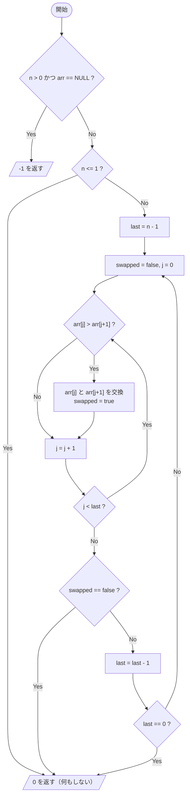
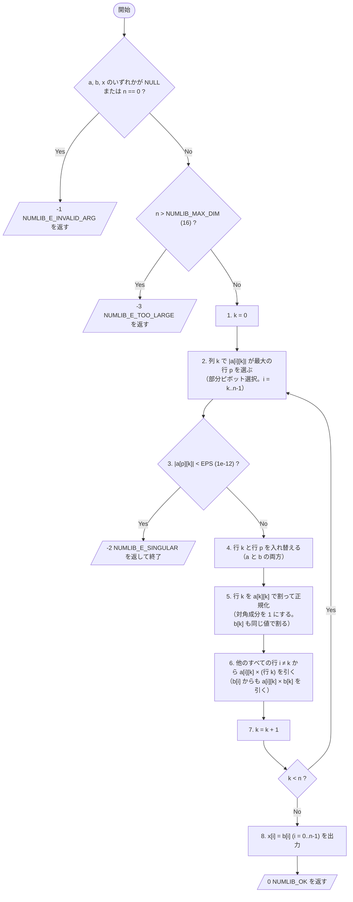

<!-- 生成: Claude (Claude Code 内の claude-fable-5-1) / 指示文: _prompt_sent.md と同一 / 生成日: 2026-09-24 -->
# 数値処理ライブラリ numlib 仕様書

**バージョン**: 0.9（原資料「numlib 機能仕様書（抜粋）」版数 0.9 を再構成）
**作成日**: 2026-09-25（原資料）／ 再構成日: 2026-09-24
**作成部署**: 制御ソフト第二課
**対象言語**: C（C99準拠）
**用途**: AIコーディングエージェントによる実装および関数レベル単体試験の自動生成の入力

※ AI検証用のダミー資料。実在の製品・顧客とは無関係

> 本書の読み方
> - 原資料（PowerPoint／Excel／図のOCR）に記載のある内容はそのまま転記している。
> - 原資料に無く、実装・試験のために本書で補った内容には **【要確認】** を付した。要確認箇所は原資料の作成者による確認が取れるまで確定仕様ではない。
> - 原資料間で記述が食い違う箇所、および図のOCR結果から意味を復元した箇所は、根拠を併記した。

---

## 1. 概要

組込み制御ソフト向けの小規模な数値処理ライブラリである。32bit整数配列の安定ソートと、連立一次方程式の求解（掃き出し法）の2関数を提供する。

- 目的：組込み制御ソフト向けの小規模な数値処理ライブラリ
- 対象言語：C（C99準拠）。コンパイラ警告ゼロ（-Wall -Wextra）
- 制約
  - 動的メモリ確保（malloc/free）は使用しない
  - スレッドセーフ非対応（呼び出し側で排他）
  - 依存ヘッダは `<stddef.h>` `<stdint.h>` のみ
  - 浮動小数点は double。printf 等の標準I/Oは使わない
- 提供関数
  - `bubble_sort_i32` … 32bit整数配列の昇順ソート（バブルソート・安定）
  - `gauss_eliminate` … 連立一次方程式 Ax = b を掃き出し法で解く

---

## 2. データ構造・定数

本ライブラリは構造体やグローバル状態を持たず、すべての関数は呼び出し側が用意した配列に対して直接動作する（in-place）。

### 2.1 定数・エラーコード（ヘッダで定義）

```c
#include <stddef.h>
#include <stdint.h>

/* gauss_eliminate の最大次元（原資料: NUMLIB_MAX_DIM = 16） */
#define NUMLIB_MAX_DIM   16

/* 特異判定しきい値（原資料: 「EPS はヘッダで定数定義」「EPS=1e-12」「EPSは 1e-12 固定」） */
#define NUMLIB_EPS       1e-12   /* 【要確認】シンボル名。原資料には「EPS」としか書かれていない */

/* エラーコード（原資料 4章「エラーコード一覧」／ Excel「エラーコード」シート） */
#define NUMLIB_OK              0
#define NUMLIB_E_INVALID_ARG  -1
#define NUMLIB_E_SINGULAR     -2
#define NUMLIB_E_TOO_LARGE    -3
```

【要確認】エラーコードを `#define` とするか `enum` とするかは原資料に記載がない。上記は `#define` 案。

| 値 | シンボル | 意味 | 発生する関数 |
|---|---|---|---|
| 0 | `NUMLIB_OK` | 成功 | 全関数 |
| -1 | `NUMLIB_E_INVALID_ARG` | NULL ポインタ、n == 0 など引数不正 | 全関数 |
| -2 | `NUMLIB_E_SINGULAR` | 特異行列（解が一意に定まらない） | gauss_eliminate |
| -3 | `NUMLIB_E_TOO_LARGE` | n が NUMLIB_MAX_DIM(16) を超えた | gauss_eliminate |

### 2.2 行列の格納形式（gauss_eliminate）

- n×n 行列 A は **行優先（row-major）** の1次元配列 `a` に格納する。本書で `a[i][k]` と書いた要素は `a[i * n + k]`（0 <= i, k < n）を指す。
- 右辺ベクトル b、解ベクトル x は長さ n の1次元配列。
- 【要確認】`a`・`b`・`x` は互いに重ならない領域であること（原資料に記載なし。`a` と `b` は処理中に破壊されるため、重なると結果が不定になる）。

---

## 3. API 一覧

| # | ID | 関数名 | 概要 | 戻り値 |
|---|---|---|---|---|
| 1 | F-001 | `bubble_sort_i32` | int32 配列の昇順ソート（安定） | 0=成功 / -1=引数不正 |
| 2 | F-002 | `gauss_eliminate` | Ax=b を掃き出し法で解く（部分ピボット） | 0=成功 / -1=引数不正 / -2=特異 / -3=n>16 |

---

## 4. 各関数仕様

### 4.1 `bubble_sort_i32` — 32bit整数配列の昇順ソート（安定）

**シグネチャ**:
```c
int bubble_sort_i32(int32_t *arr, size_t n);
```

**目的**: arr[0..n-1] を昇順に並べ替える。等しい値の相対順序は保つ（安定ソート）。

**引数**:
| 引数 | 型 | 意味 | 制約 |
|---|---|---|---|
| `arr` | `int32_t *` | 整列対象の配列 | n > 0 のとき非NULL であること |
| `n` | `size_t` | 要素数 | 0 以上。n <= 1 のときは何もしない |

**戻り値**:
- `0`（`NUMLIB_OK`）: 成功
- `-1`（`NUMLIB_E_INVALID_ARG`）: 引数不正（n > 0 かつ arr == NULL）
- n == 1 かつ arr == NULL のときの扱いは原資料の2つの記述が競合する。本書の案と試験は T14 を参照（要確認事項）。

**事後条件**（成功時）:
- すべての i（0 <= i < n-1）について arr[i] <= arr[i+1]
- 要素の多重集合は不変（要素の追加・消失・値の変化がない）
- 等しい値どうしの相対順序は入力時のまま（安定）。このため隣接要素の交換は厳密な大小（arr[j] > arr[j+1]）のときのみ行い、等しいときは交換しない
- n <= 1 のときは arr の内容を変更しない

**失敗時の状態**:
- `-1` を返す場合（n > 0 かつ arr == NULL）、メモリへの読み書きは一切行わない（arr が NULL のため参照しない）。

**計算量**: 時間 O(n^2)、追加メモリ O(1)。既ソート入力では 1 パスで終了する（早期終了フラグ）。

**処理概要**（原資料に図なし。事後条件・計算量の記述から本書で補った手順。【要確認】）:



- 1 パス（P1〜P5）で交換が 1 回も無ければ終了する（早期終了フラグ = swapped）。既ソート入力は 1 パス目でこの条件を満たす。
- 各パス終了時点で arr[last] にそのパスでの最大値が確定するため、次パスの比較範囲を 1 つ縮める。

---

### 4.2 `gauss_eliminate` — 連立一次方程式 Ax = b の求解（掃き出し法）

**シグネチャ**:
```c
int gauss_eliminate(double *a, double *b, double *x, size_t n);
```

**目的**: n×n 行列 A と右辺 b から Ax = b の解 x を求める（部分ピボット選択付き掃き出し法）。

**引数**:
| 引数 | 型 | 意味 | 制約 |
|---|---|---|---|
| `a` | `double *` | n×n 行列を行優先（row-major）で格納した配列 | 非NULL。作業領域として破壊してよい |
| `b` | `double *` | 右辺ベクトル（長さ n） | 非NULL。作業領域として破壊してよい |
| `x` | `double *` | 解の出力先（長さ n） | 非NULL |
| `n` | `size_t` | 次元 | 1 以上 16 以下（NUMLIB_MAX_DIM = 16） |

**戻り値**:
- `0`（`NUMLIB_OK`）: 成功
- `-1`（`NUMLIB_E_INVALID_ARG`）: 引数不正（NULL または n == 0）
- `-2`（`NUMLIB_E_SINGULAR`）: 特異行列
- `-3`（`NUMLIB_E_TOO_LARGE`）: n > 16

**特異判定**: ピボット選択後の |a[k][k]| < 1e-12 のとき特異とみなす（EPS はヘッダで定数定義）。
- 原資料の不等号どおり厳密な「未満」で判定する。|a[k][k]| == 1e-12 は特異とみなさない。

**精度**: 条件数 1e6 以下の行列で相対誤差 1e-9 以内。
- 【要確認】「相対誤差」の定義は原資料に無い。本書では max_i |x[i] - x_true[i]| / max_i |x_true[i]|（無限大ノルムでの相対誤差）と解釈し、試験判定にもこれを用いる。

**事後条件**（成功時）:
- x[0..n-1] に Ax = b の解が格納される（精度は上記）
- a[0..n*n-1]、b[0..n-1] の内容は不定（作業領域として破壊される。呼び出し側は元の A, b が必要なら事前に複写すること）
- x 以外の呼び出し側メモリには書き込まない

**失敗時の状態**:

| 戻り値 | a, b | x |
|---|---|---|
| -1（引数不正） | 変更されない | 変更されない |
| -3（n > 16） | 変更されない | 変更されない |
| -2（特異） | 特異と判定された列 k までの行操作が適用済みで、内容は不定 | 変更されない |

【要確認】上表の「変更されない」は原資料に明記が無い。引数チェック（-1／-3）を本処理の前に行うこと、および処理フロー上 x への書き込みが最終手順8でのみ行われることから導いた保証である。

**引数チェックの順序**（【要確認】原資料に記載なし。本書の案）:
1. a, b, x のいずれかが NULL、または n == 0 → -1
2. n > NUMLIB_MAX_DIM（16） → -3
3. 本処理へ（処理中に特異と判定されたら -2）

例: a == NULL かつ n == 17 のときは -1 を返す（T21）。

#### 4.2.1 処理フロー（原資料5章の図を復元）

原資料の図には本文が無く、OCR結果（Apple Vision）から復元した。OCR原文と復元結果の対応は 4.2.2 に示す。図の手順1〜8に加え、戻り値仕様（-1／-3）から導かれる引数チェックを先頭に補っている（順序は上記「引数チェックの順序」の案）。



補足（復元にあたっての判断）:
- 【要確認】手順2のピボット探索範囲 i = k..n-1 は図に明記が無い。手順6で全行（i ≠ k）を消去する掃き出し法（Gauss-Jordan）では、行 k より上の行も列 k に非ゼロ成分を持ちうるが、それらをピボットに選ぶと既に完成した列が壊れるため、探索は行 k 以降に限る必要がある。
- 【要確認】|a[i][k]| が最大となる行が複数ある場合の選び方は原資料に無い。本書案: 最小の行番号 i を選ぶ。p == k のときは手順4の入替を省略してよい。
- 手順3は入替前の行 p の値 |a[p][k]| で判定している。手順4の入替後は a[k][k] が（入替前の）a[p][k] になるため、本文の「ピボット選択後の |a[k][k]| < 1e-12」と等価である。
- 手順5・6は拡大係数行列 [A | b] に対する行操作であり、a だけでなく b にも同じ操作を適用する。手順4の「aとbの両方」および手順8「x = b」が成立するための必然であり、図の文言に b が省かれているのは表記の省略と判断した。
- 手順1〜8を k = n-1 まで完了すると A は単位行列になり、b に解が残る（手順8）。
- 図のキャプションは「図6-1」だが、原資料 PowerPoint では5章に置かれている（原資料のまま）。

#### 4.2.2 OCR 結果の復元対応表

| # | OCR原文（信頼度） | 復元 | 根拠 |
|---|---|---|---|
| 1 | `1. 開始（k=0）`（0.50） | 開始。k = 0 | そのまま |
| 2 | `2.列kで1allIk］が最大の行pを選ぶ（部分ピボット選択）`（0.50） | 列 k で `\|a[i][k]\|` が最大の行 p を選ぶ（部分ピボット選択） | `1allIk］` は `\|a[i][k]\|` の誤読（指示文の誤読例と同一パターン）。本文「部分ピボット選択付き」と一致 |
| 3 | `3.lalp］［k］ < EPS（1e-12） ？ → Yes： E_SINGULAR（-2）を返して終了`（1.00） | `\|a[p][k]\| < EPS (1e-12)` ? → Yes: `NUMLIB_E_SINGULAR`（-2）を返して終了 | `lalp］［k］` は `\|a[p][k]\|` の誤読。本文「ピボット選択後の \|a[k][k]\| < 1e-12」と等価 |
| 4 | `4. 行kと行pを入れ替える（aとbの両方）`（0.50） | 行 k と行 p を入れ替える（a と b の両方） | そのまま |
| 5 | `5. 行kをalkjIk］で割って正規化（対角成分を1にする）`（0.50） | 行 k を `a[k][k]` で割って正規化（対角成分を 1 にする） | `alkjIk］` は `a[k][k]` の誤読。「対角成分を1にする」から確定 |
| 6 | `6.他のすべての行 i#kから allIk］x（行k）を引く`（0.50） | 他のすべての行 i ≠ k から `a[i][k]` × (行 k) を引く | `i#k` は `i≠k`、`allIk］` は `a[i][k]` の誤読。消去操作の定義どおり |
| 7 | `7.k=k+1。k<n なら2へ戻る`（0.50） | k = k + 1。k < n なら手順2へ戻る | そのまま |
| 8 | `8.x［l＝b［］を出力して0を返す`（0.50） | `x[i] = b[i]` を出力して 0 を返す | `x［l＝b［］` は `x[i] = b[i]` の誤読。手順5・6完了後は A = I なので b が解 |
| 9 | `図6-1掃き出し法（ガウスの消去法）の処理フロー ※EPSは 1e-12 固定`（0.50） | 図6-1 掃き出し法（ガウスの消去法）の処理フロー ※EPS は 1e-12 固定 | そのまま。EPS = 1e-12 は本文・Excel とも一致 |

---

## 5. エラー処理方針

- 戻り値方式（`int`）で通知する。`0` = 成功、負値 = 失敗。値とシンボルは 2.1 のエラーコード表に従う。
- `errno`、`assert`、ログ出力は使用しない（依存ヘッダが `<stddef.h>` `<stdint.h>` のみであるため `<errno.h>` `<assert.h>` `<stdio.h>` は取り込めない）。
- NULL ポインタ引数はエラーとして扱い、クラッシュせずに `-1` を返す。NULL の参照（読み書き）は行わない。
- 引数エラー（-1／-3）は本処理の前に判定し、判定した時点で呼び出し側メモリを変更せずに返る（4.2「失敗時の状態」の要確認事項を参照）。
- 複数のエラー条件が同時に成立する場合の優先順位は -1（引数不正）> -3（n > 16）> -2（特異）（4.2「引数チェックの順序」の要確認事項を参照）。
- 動的メモリ確保・解放は一切行わない。
- 【要確認】NaN／Inf を含む入力に対する動作は原資料に記載が無く、本書でも未定義とする（試験対象外）。

---

## 6. 非機能要件

| 項目 | 仕様 |
|---|---|
| 言語・コンパイル | C（C99準拠）。コンパイラ警告ゼロ（-Wall -Wextra） |
| 依存ヘッダ | `<stddef.h>` `<stdint.h>` のみ |
| 浮動小数点 | double |
| 標準I/O | printf 等の標準I/Oは使わない |
| ヒープ使用 | なし（malloc/free 不使用） |
| スレッドセーフ | 非対応。呼び出し側で排他 |
| 割り込みセーフ | 非対応【要確認】（原資料に記載なし。ISR から呼ぶ場合は呼び出し側で排他） |
| 再入可能性 | 静的・グローバル変数を持たないため、別の配列に対してなら再入可【要確認】（原資料に記載なし） |
| スタック使用 | 作業配列を持たず in-place で処理するため、数十バイト程度の定数【要確認】（原資料に記載なし） |
| 計算量 bubble_sort_i32 | 時間 O(n^2)、追加メモリ O(1)。既ソート入力では 1 パスで終了する（早期終了フラグ） |
| 計算量 gauss_eliminate | 時間 O(n^3)、追加メモリ O(1)【要確認】（原資料に記載なし。n <= 16 のため乗算回数は最大でも 16^3 程度） |
| 精度 gauss_eliminate | 条件数 1e6 以下の行列で相対誤差 1e-9 以内 |
| 次元上限 | gauss_eliminate は n <= NUMLIB_MAX_DIM（16）。bubble_sort_i32 の n に上限なし（size_t の範囲） |

---

## 7. 使用例

呼び出し側のコード例（ライブラリの実装ではない）。原資料の制約に従い標準I/Oは使わない。ヘッダ名 `numlib.h` は 9章参照。

```c
#include "numlib.h"

static int example(void)
{
    /* --- bubble_sort_i32 --- */
    int32_t v[5] = { 3, -1, 0, -7, 2 };
    if (bubble_sort_i32(v, 5) != NUMLIB_OK) {
        return -1;
    }
    /* ここで v == { -7, -1, 0, 2, 3 } */

    /* --- gauss_eliminate: A = [[2, 1], [1, 3]], b = (4, 7) → x = (1, 2) --- */
    double a[2 * 2] = { 2.0, 1.0,
                        1.0, 3.0 };   /* 行優先: a[i][k] は a[i * 2 + k] */
    double b[2]     = { 4.0, 7.0 };
    double x[2];

    int rc = gauss_eliminate(a, b, x, 2);
    if (rc == NUMLIB_E_SINGULAR) {
        return -2;                    /* 特異行列。x は未設定 */
    }
    if (rc != NUMLIB_OK) {
        return -1;                    /* 引数不正 / n > 16 */
    }
    /* ここで x[0] ≒ 1.0, x[1] ≒ 2.0。a, b は破壊されている */
    return 0;
}
```

---

## 8. 単体試験観点

### 8.1 原資料の試験観点（T01〜T12）

原資料 PowerPoint 6章の T01〜T12 を引き継ぐ。「分類」列は Excel「試験項目」シートの「観点」列による（T02／T05／T07／T12 は Excel に無いため本書で補い「（補）」を付けた。【要確認】）。「入力例」列は原資料に具体値が無い項目について本書が例示したもので、原資料の意図と異なる場合は差し替えてよい。

| No | 対象 | 観点 | 入力例 | 期待結果 | 分類 |
|---|---|---|---|---|---|
| T01 | bubble_sort_i32 | n = 0 / n = 1 | arr = {5} に対して n = 0 および n = 1 | 0 を返し配列は不変 | 境界 |
| T02 | bubble_sort_i32 | 既に昇順の入力 | {1, 2, 3, 4, 5} | 0、順序不変、比較は 1 パスのみ | 正常（補） |
| T03 | bubble_sort_i32 | 逆順の入力（n = 8） | {8, 7, 6, 5, 4, 3, 2, 1} | 0、昇順になる | 正常 |
| T04 | bubble_sort_i32 | 重複値を含む入力 | {3, 1, 3, 2, 1} | 0、安定性が保たれる | 安定性 |
| T05 | bubble_sort_i32 | INT32_MIN / INT32_MAX を含む | {INT32_MAX, 0, INT32_MIN, -1, 1} | 0、オーバーフローなく整列 | 境界（補） |
| T06 | bubble_sort_i32 | arr == NULL, n = 3 | — | -1 | 異常 |
| T07 | gauss_eliminate | 単位行列 A = I, b 任意 | n = 3, b = (1.5, -2, 3) | 0、x == b | 正常（補） |
| T08 | gauss_eliminate | 2×2 で解が既知（x = (1, 2)） | A = [[2, 1], [1, 3]], b = (4, 7) | 0、誤差 1e-9 以内 | 精度 |
| T09 | gauss_eliminate | ピボット入替が必要（a[0][0] = 0） | A = [[0, 1], [1, 0]], b = (2, 1) → x = (1, 2) | 0、正しい解 | ピボット |
| T10 | gauss_eliminate | 特異行列（2行が同一） | A = [[1, 2], [1, 2]], b = (3, 3) | -2 | 特異 |
| T11 | gauss_eliminate | n = 17 | 有効なポインタ、n = 17 | -3 | 境界 |
| T12 | gauss_eliminate | a == NULL / n == 0 | a = NULL, n = 2 ／ 有効なポインタ, n = 0 | -1 | 異常（補） |

試験実施上の注意:
- T02「比較は 1 パスのみ」は API の戻り値・配列内容からは観測できない。【要確認】観測方法（試験ビルド限定の比較回数カウンタ、パス数を返す内部関数など）は原資料に無く、実装側との取り決めが必要。取り決めが無い場合、自動試験では「結果が不変で 0 を返す」ことのみを確認し、1 パス終了はコードレビューで確認する。
- T04「安定性」は要素が `int32_t` の値のみで識別子を持たないため、等しい値どうしの相対順序は API の出力からは区別できない。【要確認】自動試験では「整列結果が正しい」ことの確認に留め、安定性は交換条件が厳密な大小比較（arr[j] > arr[j+1]）であることをコードレビューで確認する。
- T05 は比較のみで実装されていれば減算等の算術を伴わず、オーバーフローは原理的に発生しない。
- T08 の誤差判定は 4.2「精度」の相対誤差定義（要確認事項）に従う。

### 8.2 追加の試験観点（T13〜T28）

原資料に無い境界値・異常系・状態保証を本書で追加する。番号は T12 から続ける。

| No | 対象 | 観点 | 入力例 | 期待結果 | 分類 |
|---|---|---|---|---|---|
| T13 | bubble_sort_i32 | n = 0 かつ arr == NULL | arr = NULL, n = 0 | 0（「n > 0 かつ arr == NULL」に該当しない） | 境界 |
| T14 | bubble_sort_i32 | n = 1 かつ arr == NULL | arr = NULL, n = 1 | -1【要確認】（「n <= 1 のときは何もしない」と「n > 0 かつ arr == NULL は -1」が競合する。本書は引数チェックを先に行い -1 とする案） | 境界・異常 |
| T15 | bubble_sort_i32 | 並べ替えが発生する最小サイズ | {2, 1}, n = 2 | 0、{1, 2} | 境界 |
| T16 | bubble_sort_i32 | 全要素が同一値 | {7, 7, 7, 7}, n = 4 | 0、不変（1 パスで終了） | 境界・安定性 |
| T17 | bubble_sort_i32 | 負数・0・正数の混在 | {3, -1, 0, -7, 2} | 0、{-7, -1, 0, 2, 3} | 正常 |
| T18 | gauss_eliminate | 最小次元 n = 1 | a = {2.0}, b = {4.0}, n = 1 | 0、x = (2.0) | 境界 |
| T19 | gauss_eliminate | 上限次元 n = 16 | A = I（16×16）, b = (1, 2, …, 16) | 0、x == b | 境界 |
| T20 | gauss_eliminate | b == NULL / x == NULL | a 有効, n = 2 で b = NULL ／ x = NULL | -1 | 異常 |
| T21 | gauss_eliminate | 引数不正と n > 16 の同時成立 | a = NULL, n = 17 | -1【要確認】（4.2「引数チェックの順序」の案に従う） | 異常・優先順位 |
| T22 | gauss_eliminate | 特異判定しきい値の境界 | n = 1, b = {1.0} で a = {1e-12} ／ a = {9e-13} | a = {1e-12}: 0、x = (1e12)（EPS ちょうどは特異でない）／ a = {9e-13}: -2 | 境界・特異 |
| T23 | gauss_eliminate | 特異返却時の x 不変 | T10 の入力で x を既知値（例: 全要素 -999.0）に初期化 | -2 かつ x が初期値のまま【要確認】（4.2「失敗時の状態」） | 異常・状態保証 |
| T24 | gauss_eliminate | 消去途中（k = 1）でピボット入替が必要 | A = [[1, 1, 1], [1, 1, 2], [1, 2, 3]], b = (3, 4, 6) → x = (1, 1, 1) | 0、正しい解（相対誤差 1e-9 以内） | ピボット |
| T25 | gauss_eliminate | 条件数 1e6 ちょうどの行列 | A = diag(1, 1e-6), b = (1, 1e-6) → x = (1, 1) | 0、相対誤差 1e-9 以内 | 精度 |
| T26 | gauss_eliminate | 負のピボット候補（絶対値で選択されること） | A = [[3, 1], [-5, 2]], b = (4, -3) → x = (1, 1) | 0、正しい解 | ピボット |
| T27 | gauss_eliminate | ゼロ行列 | A = 0（2×2）, b = (1, 1) | -2（k = 0 で特異判定） | 特異 |
| T28 | gauss_eliminate | 引数不正・n > 16 返却時の a, b, x 不変 | T11／T20 の入力で a, b, x を既知値に初期化 | 戻り値どおり、かつ a, b, x が初期値のまま【要確認】（4.2「失敗時の状態」） | 異常・状態保証 |

### 8.3 試験実装上の共通事項

- 期待値との比較: 整数は完全一致、double は 4.2 の相対誤差定義で 1e-9 以内。
- 各試験は独立に入力配列を用意する。gauss_eliminate は a, b を破壊するため、期待値は別に保持した値と比較する。
- 【要確認】試験コード自体も原資料の制約（動的メモリ確保なし、標準I/Oなし）に従うかは原資料に記載がない。試験コードはターゲット外のホスト環境で実行される可能性があるため、取り決めが必要。

---

## 9. ファイル構成（実装時）

```
numlib/
├── numlib.h        … 本仕様書の定義（NUMLIB_MAX_DIM、EPS、エラーコード、関数プロトタイプ）
├── numlib.c        … 実装（bubble_sort_i32、gauss_eliminate）
└── test_numlib.c   … AI生成の単体試験コード（T01〜T28）
```

【要確認】ファイル名・ディレクトリ名は原資料に記載がない（上記はライブラリ名「numlib」からの案）。

---

## 10. 改訂履歴

| 版 | 日付 | 内容 | 作成者 |
|---|---|---|---|
| 0.8 | 2026-09-10 | 初版（レビュー前） | 制御ソフト第二課 |
| 0.9 | 2026-09-25 | エラーコード -3 を追加、試験観点 T09〜T12 追記 | 制御ソフト第二課 |
| 0.9-r1（案） | 2026-09-24 | 原資料（PowerPoint／Excel／図OCR）を本書式に再構成。処理フロー図を OCR から復元し Mermaid 化。試験観点 T13〜T28 を追加。要確認箇所は未確定 | AI再構成（レビュー待ち） |
