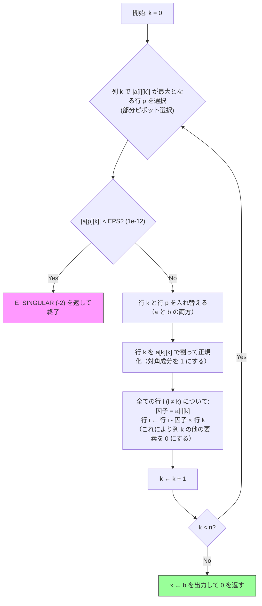

# Nemotron B の Mermaid 図（人が最小限の修正を加えた版）

元の図（`spec_nemotron.md` 末尾）は Mermaid の文法エラーで描画できない（ノード内の `|` と `[ ]` が裸）。
直したのは 2 点だけ：**(1) 全ノードのラベルを引用符で囲む、(2) 特異判定の添字 `a[p][p]` → `a[p][k]`**（OCR 原文は `lalp］［k］`）。

